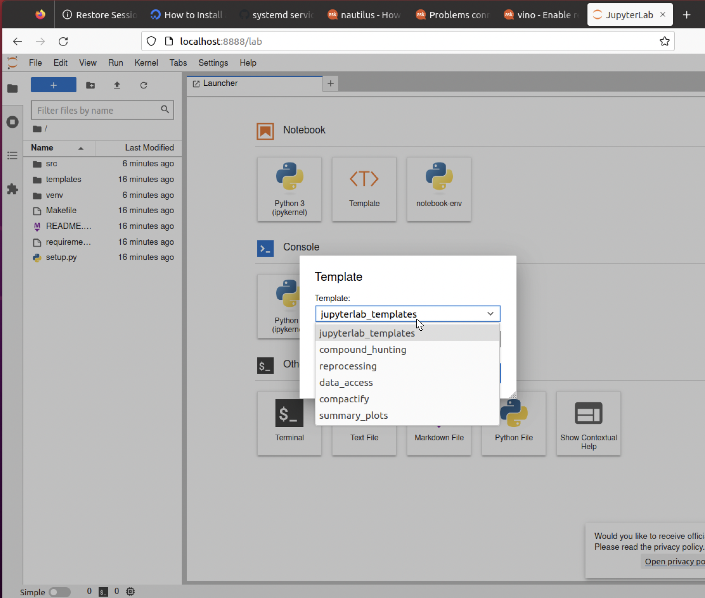
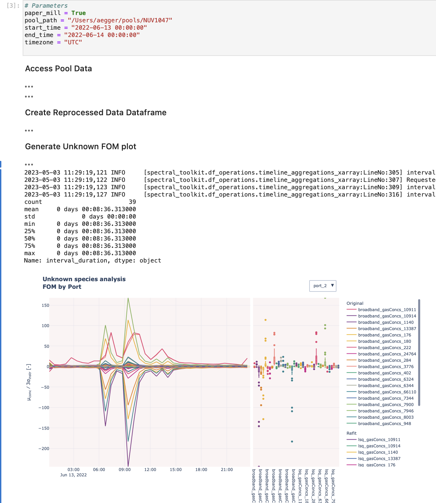

# picarro-notebooks
Collection of Jupyter notebooks used for different data analysis tasks

## About
This repository will contain notebooks of different analyses for different applications.  This allows for the user to customize analysis and have more visibility on the calculations performed and errors that may arise.  They come in the form of templates that are also runnable by papermill.

This is NOT a place to keep any random notebook that has been created, but more a jumping off point for people who want to be able to create an analysis from different templates

### Caution
Implementing jupyter hub from this repository has the possibility of breaking existing widgets, configurations, and extensions used by your current version.  You can try to run them together, but it's best to create a new instance from scratch using this repository.

If you find widgets/ipy tools missing that you need, please pip install them and then notify aegger@picarro.com so he can update dependency list

## Instllation and Running

### Locally From Source

To install the needed dependencies run the following under picarro-notebooks top level directory

```bash
$ make develop
```

Once the dependencies have been installed you can do the following to run jupyterlab

```bash
$ source venv/bin/activate
$ make setup_env
```

Now start jupyter
```bash
$ jupyter-lab
```

You can now select notebook-env as your kernel in jupyter

### Docker

To run in a container, first get the needed .env file

```bash
$ make jup_env
```

You will also need a pip.conf file for Picarro repos, for now just copy and paste your pip.conf file
```bash
$ cp <location_of_pip>/pip.conf .
```

You can check the location of the file running the command ``pip config debug``.
For Linux and MacOS, some common location are:
- `~/.pip/pip.conf`
- `/etc/pip.conf`
- `~/.config/pip/pip.conf`

Now just run
```bash
$ docker compose up --build
```

The default user and password are in the .env file you downloaded to log in and you can visit `localhost:8001` to get to the login page

Note: You will likely need to enable file sharing if you have docker desktop on mac.  You can see directions here for modifying under settings https://docs.docker.com/desktop/settings/mac/#file-sharing.  Do this for the directory picarro-notebooks/notebook_work

The notebook_work directory in this repository will be the root work directory in docker.  This means if you need to access data (i.e. h5 files), it will need to be placed in this directory.  If you are using V1 tools, make sure the pools directory is in this local directory.

## Using Templates

Below you can see the Template "<T>" icon.  That will launch a browser with the template directory on top and the individual templates in the selector below.



We have a series of templates that allow for certain types of analyses.  As we come up with standard operations, the goal is to create a template from those so people can start their own notebook with some base code and use for their own purposes.

You can select a tempalte when creating a new notebooks.  There is never a need to edit the template directly.  Any issues with templates that are found should have a bug filed so they can be fixed.

If more templates are needed (they are), feel free to request a specific type of template or run through the directions below to make your own template.  Templates should be small and focues on individual componenets of an analysis pipeline, easier said than done.  The hope is a user isn't overwhelmed with a lot of code and can instead do something specifiec.

## Using Papermill

https://papermill.readthedocs.io/en/latest/

Sometimes you may want to just run a bunch of notebooks and look at outputs.  The templates allow for that as well.  Say we want to reprocess a few date ranges.

Using the templates create a reprocessing template.  Now inspect the arguments

https://papermill.readthedocs.io/en/latest/usage-inspect.html

We can see we need to define a few arguments for this one

CLI

```bash
(venv) scl-aegger-mpb:picarro-notebooks aegger$ papermill --help-notebook reprocess_demo.ipynb 
Usage: papermill [OPTIONS] NOTEBOOK_PATH [OUTPUT_PATH]

Parameters inferred for notebook 'reprocess_demo.ipynb':
  paper_mill: bool (default False)
  valve_mask: str (default "ValveMask")
  nominal_pressure: float (default 140.0)
  pool_path: str (default None)
  start_time: str (default None)
  end_time: str (default None)    
  timezone: str (default None)    
  reference_port: int (default 1)
  dont_fit: list[int] (default [280, 977, 947, 962, 297])
  cids_to_add: list[int] (default [638186])
```

It looks like the only arguments we need to pass in are

paper_mill - we must set this to true for papermill to work
pool_path - path to pool with analyzer
start_time - time in format 2022-06-13 00:00:00
end_time - 2022-06-14 00:00:00
timezone - a pytz timezone, we'll use "UTC"

These are a lot of parameters, when using a CLI like this, you can define a yaml file with all the parameters defined to ease the verbosity of the CLI

```yaml
paper_mill: true
pool_path: /Users/aegger/pools/NUV1047
start_time: 2022-06-13 00:00:00
end_time: 2022-06-14 00:00:00
timezone: UTC
```

Once we are ready to run to create a standard output
```bash
(venv) scl-aegger-mpb:picarro-notebooks aegger$ papermill reprocess_demo.ipynb reprocess_demo_output.ipynb -f demo.yaml
Input Notebook:  reprocess_demo.ipynb
Output Notebook: reprocess_demo_output.ipynb
Black is not installed, parameters wont be formatted
Executing:   0%|                                                                                                       | 0/13 [00:00<?, ?cell/s]Executing notebook with kernel: notebook-env
Executing: 100%|██████████████████████████████████████████████████████████████████████████████████████████████| 13/13 [01:45<00:00,  8.11s/cell]
```

Now let's look at our output notebook



Now you can view a fully run notebook without altering the original.  You can write python scripts to iterate through many different input args.  Papermill creates a cell with the parameter values input from the yaml.  This is nice if you're exploring and want to run a bunch overnight and look at the output results in the morning.

## Contributing

Notebook templates have a very distinct pattern.  In order to keep them as usable tempaltes there are a few things the contributor must do when submitting a PR for a new template

### Make a top level description and table of contents for the notebook

Example Markdown:

```bash
# Generate Summary Plots SAM Template

## Objectives of Notebook
It is best to run through the entire notebook the first time to understand the different components.  At the end of this notebook you should be able to:
- Access Pool Data for Plots
- Create and Browse Allan Plots for SAM data
- Create a Timeline Plot for SAM data
- Create a Port Averaged Plot for SAM data
- Create an Unknown Identification Plot for SAM Data

## Notebook Content
- [Summary Plot Imports](#plot_imports)
- [Parameters](#parameters)
- [Access Pool Data](#access_pool_data)
- [Create Summary Plot](#summary_plot)
```

### Link the tags to the particular header below

Example Section Markdown:

```bash
## Summary Plot Imports
<a id='plot_imports'></a>
```

### Create a parameters section with a paper_mill: bool = False line

Example Parameters Section

```bash
# papermill run, if set, we expect that all None parameters will be set
paper_mill: bool = False

# Label the reference port and sample port to analyze in this period
reference_port: int = 1

valve_mask: str = "ValveMask"

# string path to pool with analyzer (i.e. /Users/foo/pools/NUV1047
pool_path: str = None

# results path to location for saving output
results_path: str = None

# string for start and end times format ('2022-06-13 00:00:00')
start_time: str = None
end_time: str = None

# Time zone in pytz.all_timezones
timezone: str = None
```

### Create a tag for the parameters cell

You will need to create a tag for the parameters cell so that papermill knows how to run it
